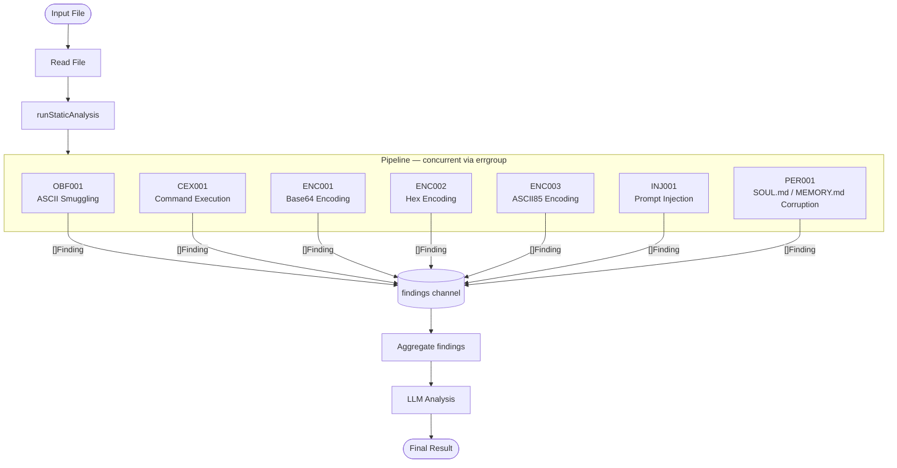

# Cadrega 🪑🍎

- [Description](#description)
- [Pipeline](#pipeline)
- [Requirements](#requirements)
- [Installation](#installation)
- [Usage](#usage)
- [Usage of LLMs](#usage-of-llms)
- [Contributing](#contributing)
- [Resources](#resources)
- [License](#license)

## Description

>[!NOTE]
> Cadrega is under active development. Integration with LLMs is limited to Ollama.

Cadrega is an hybrid analysis tool (static analysis + LLM analysis) for malicious [Skills](https://agentskills.io/home)

## Pipeline



## Requirements

- [Go](https://go.dev/) >= 1.26.1
- [Ollama](https://ollama.com/) (for local inference)

## Installation

```bash
# Clone the repo
$ git clone https://github.com/utox39/cadrega.git

# cd to the path
$ cd path/to/cadrega

# Build cadrega
$ go build -ldflags "-w -s" -o cadrega cmd/cadrega/main.go

# Then move it somewhere in your $PATH. Here is an example:
$ mv ./cadrega ~/bin/
```

## Usage

```text
NAME:
   cadrega - Malicious Skills Detector

USAGE:
   cadrega [global options] <skillpath>

GLOBAL OPTIONS:
   --provider string  the LLM provider to use (ollama, anthropic, openai) (default: "ollama")
   --model string     the model name to use
   --address string   the Ollama server address (default: "localhost")
   --port uint        the Ollama server port (default: 11434)
   --think            whether the Ollama model should use Thinking
   --unload-model     whether to unload the model immediately after the LLM analysis is complete
   --num-ctx uint     the Ollama context window size (in tokens) (default: 8192)
   --help, -h         show help

```

## Usage of LLMs

For transparency: LLMs are used (with strict manual review and intervention when
necessary) to assist me with:

- Writing boilerplate code
- Writing documentation
- Creating simple, tedious scripts like [scripts/extract_npm_packages.py](https://github.com/utox39/cadrega/blob/main/scripts/extract_npm_packages.py)
- Writing some regular expressions
- Fixing bugs (especially those related to functions/methods and concepts I’m
not an expert in)
- Brainstorming

## Contributing

Please see [CONTIBUTING](https://github.com/utox39/cadrega/blob/main/CONTRIBUTING.md). Thanks!

## Resources

- [Technical Report: Exploring the Emerging Threats of the Agent Skill Ecosystem](https://github.com/snyk/agent-scan/blob/main/.github/reports/skills-report.pdf)
- [Snyk Finds Prompt Injection in 36%, 1467 Malicious Payloads in a ToxicSkills Study of Agent Skills Supply Chain Compromise](https://snyk.io/blog/toxicskills-malicious-ai-agent-skills-clawhub/#our-methodology-building-a-threat-taxonomy)
- [280+ Leaky Skills: How OpenClaw & ClawHub Are Exposing API Keys and PII](https://snyk.io/blog/openclaw-skills-credential-leaks-research/)
- [Researchers Find 341 Malicious ClawHub Skills Stealing Data from OpenClaw Users](https://thehackernews.com/2026/02/researchers-find-341-malicious-clawhub.html)
- [“Do Anything Now”: Characterizing and Evaluating In-The-Wild Jailbreak Prompts on Large Language Models](https://arxiv.org/abs/2308.03825)
- [LLM Prompt Injection Prevention Cheat Sheet](https://cheatsheetseries.owasp.org/cheatsheets/LLM_Prompt_Injection_Prevention_Cheat_Sheet.html)
- [STAN Prompt Injection](https://www.reddit.com/r/ChatGPTPromptGenius/comments/15ptsea/strive_to_avoid_norms_stan_prompt/)
- [UCAR Prompt Injection](https://arxiv.org/pdf/2311.16119v3)
- [AST01 — Malicious Skills](https://owasp.org/www-project-agentic-skills-top-10/ast01)
- [ecosyste-ms/typosquatting-dataset](https://github.com/ecosyste-ms/typosquatting-dataset)
- [Go code for Shannon entropy](https://github.com/chrisjchandler/entropy)

## License

MIT License. See: [LICENSE](https://github.com/utox39/cadrega/blob/main/LICENSE)
